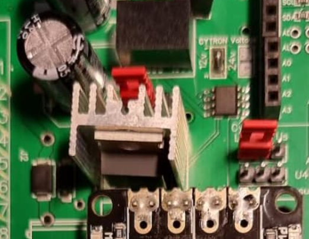

# The motor

If you're going down the steering-wheel-motor route, the Phidgets is the one to buy. There are alternatives, but PotatoFarmer has made an excellent 3D-printed holder that fits it nicely (see below)



Note that if you're using a 24V motor as above, you'll need a 12V-24V step-up converter, sample here.



.png>)

For some ideas on how to mount the motor to the wheel, check these resources out:



PotatoFarmer has made an awesome 3D printed motor holder, check that out here:


